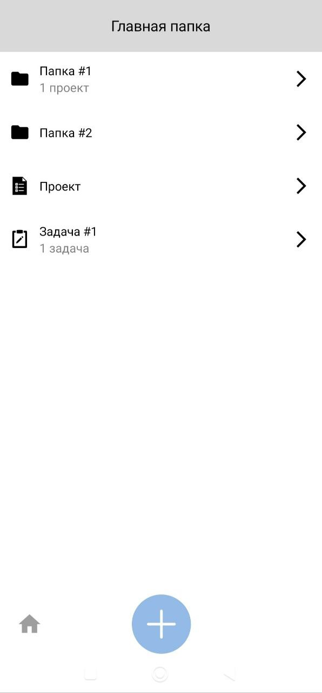
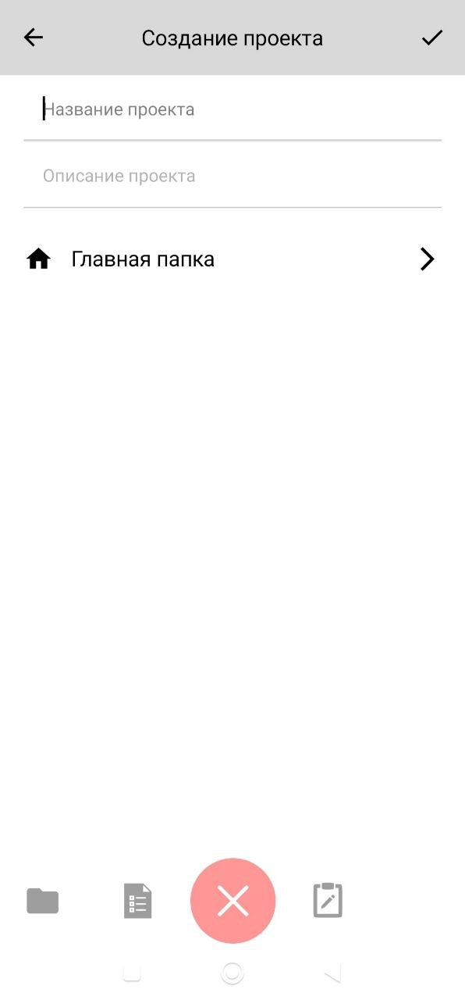
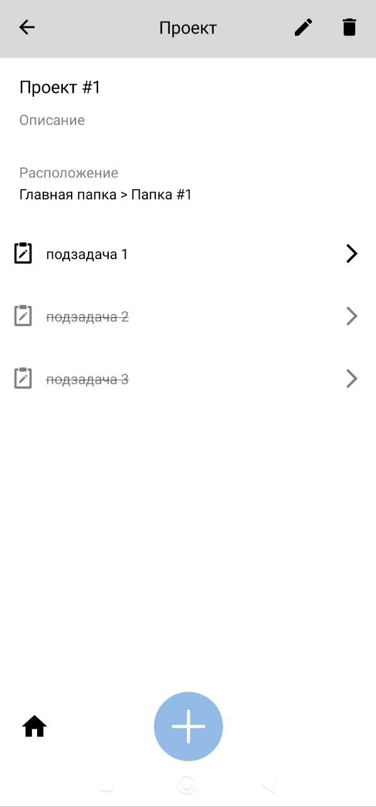
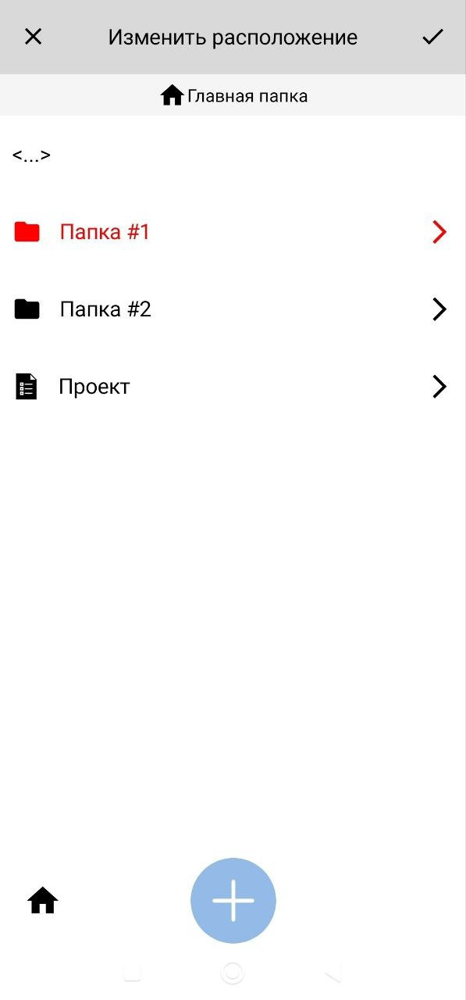

# SuperTodo 
SuperTodo (временное название) - это приложение для управления задачами, разработанное для упрощения их организации. 

## Версия
`2.1.0-alpha`

## Возможности
- Создание папок, проектов, задач (далее "элементов")
- Редактирование элементов
- Удаление элементов
- Отметка выполнения задач и проектов.

## Скриншоты

| Главная папка (стартовая страница) | Создание элемента |
| :---: | :---: |
|  |  |
| Просмотр элемента | Изменение расположения элемента |
|  |  |

## Тех. Стек
- Разработка
	- Kotlin
	- Jetpack Compose
	- LifeCycle
	- Hilt
	- Navigation
	- Room DataBase
	- Coroutines
	- MVVM-шаблон
- Проектирование
	- Figma
	- Draw.io

## Архитектура
Используется модульная структура с разделением ответственности:
- Data: Слой данных
- Domain: Слой бизнес-логики
- Presentation: Слой пользовательского интерфейса
